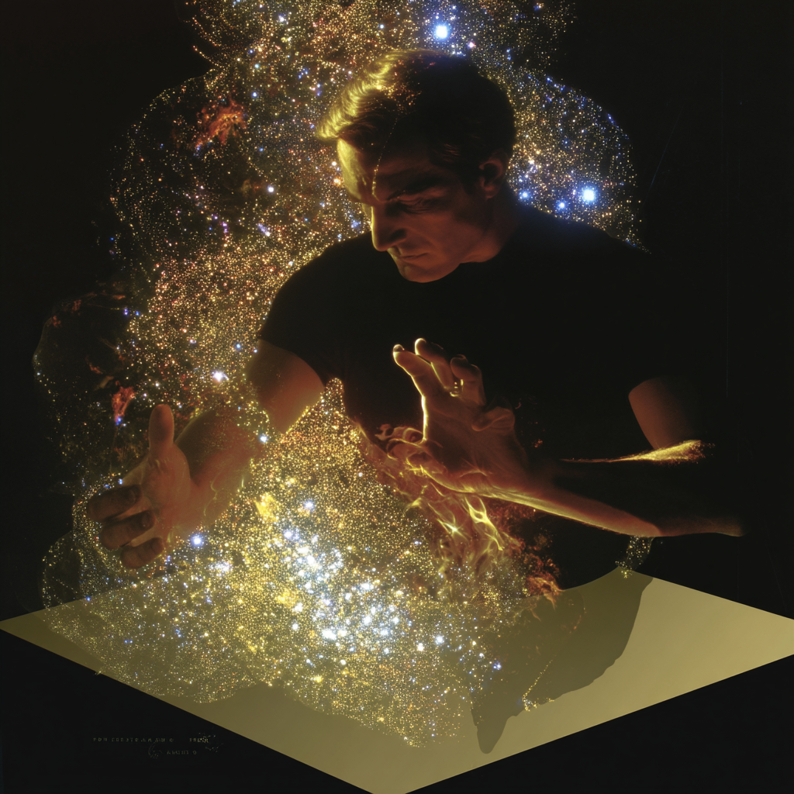

# PyTorch do Zero 🧗

Mini-curso em lingua portuguesa sobre conceitos elementares de aprendizado profundo e implementações em PyTorch (em alto nível) de arquiteturas atuais (2026).

## Slides
* [**Template**](https://www.canva.com/design/DAG-9JaXVSs/_qxpl5GlFT-jcPEezZXKKg/edit)
* [**Aula 1**](https://www.canva.com/design/DAG-b3J3u60/28_F_8UHTC_aucCw7v2xpA/edit)   
* [**Aula 2**](https://www.canva.com/design/DAG-9HF7qYc/Nt8mtHhqq7eXPx9vCNvVfA/edit)   
* [**Aula 3**](https://www.canva.com/design/DAHAjkAWAns/2f2kWdl9cMH8zIMfRSQ8DA/edit?utm_content=DAHAjkAWAns&utm_campaign=designshare&utm_medium=link2&utm_source=sharebutton)
* [**Aula 4**](https://www.canva.com/design/DAHAjlHEpRQ/pFNCy544KmOPP__124KwKA/edit?utm_content=DAHAjlHEpRQ&utm_campaign=designshare&utm_medium=link2&utm_source=sharebutton)
* **Aula 5**
* **Aula 6**  
* [**Aula 7**](https://www.canva.com/design/DAG9fDHYAlI/AD4SYNs7pFpeOb1I1u1PwQ/edit?utm_content=DAG9fDHYAlI&utm_campaign=designshare&utm_medium=link2&utm_source=sharebutton)    
* [**Aula 8**](https://www.canva.com/design/DAG-NrnFfCE/XRNhiJ_zJV8m06pWkmk8zg/edit?utm_content=DAG-NrnFfCE&utm_campaign=designshare&utm_medium=link2&utm_source=sharebutton)    
* [**Aula 9**](https://www.canva.com/design/DAHAXV2e7Ck/91cr7Ms2TUw24Ch-Qh8X5w/edit?utm_content=DAHAXV2e7Ck&utm_campaign=designshare&utm_medium=link2&utm_source=sharebutton)
* **Aula 10**
    
## Referências
* **Goodfellow, I., Bengio, Y., & Courville, A.** (2016). [*Deep Learning*](http://www.deeplearningbook.org). MIT Press.
* **Amini, A., & Amini, A.** (2025). [*6.S191: Introduction to Deep Learning*](http://introtodeeplearning.com). MIT.
* **Karpathy, A.** (2022-2024). [*Neural Networks: Zero to Hero*](https://karpathy.ai/zero-to-hero.html) [Video series]. YouTube.
* **Sanderson, G. (3Blue1Brown).** (2017–2025). [*Neural Networks*](https://www.3blue1brown.com/topics/neural-networks) [Video series]. YouTube.
