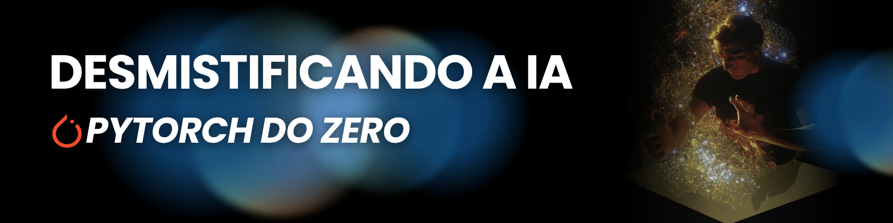
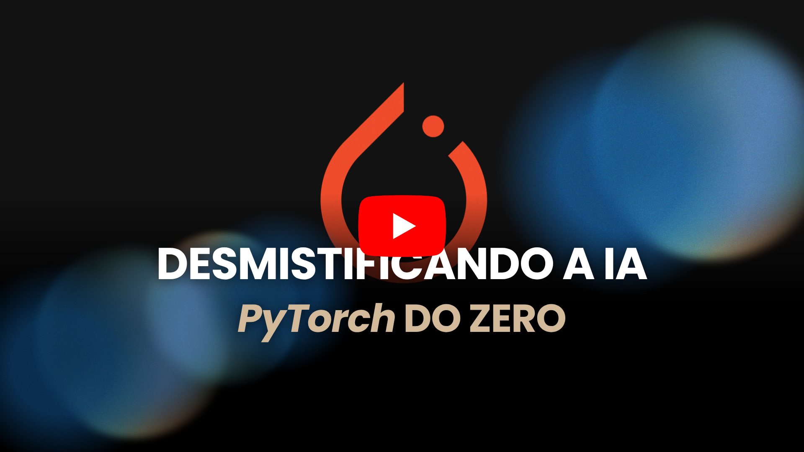

Este repositório contém todo material didático relativo a [Desmistificando a IA: Pytorch do Zero](https://pytorch-do-zero.web.app/), uma atividade de extensão ensinando sobre *redes neurais*, a arquitetura de IA por trás dos *LLM*'s, de carros autônomos, dentre várias outras tecnologias, atravessando seus fundamentos teóricos, implementações em código Python e como aplicá-las em produção.

A atividade foi desenvolvido em 2026 por estudantes de graduação do [ICMC-USP](https://www.icmc.usp.br/), em São Carlos, dos cursos de Matemática Aplicada e de Estatística, sob orientação do Prof. Dr. Lucas Valem, do Depto. de Ciência da Computação.

## Videoaulas

Todas as aulas estão disponíveis publicamente. Clique no link acima para vê-las!

## Códigos
Vide o diretório [`recursos/codigos/`](recursos/codigos/).

## Slides
<table>
  <tr>
    <td valign="top">
      <ul>
        <li><a href="https://canva.link/dmeot17kddjumzo"><b>Aula 1</b></a></li>
        <li><a href="https://canva.link/7fvzqz2e3hu7k4a"><b>Aula 2</b></a></li>
      </ul>
    </td>
    <td valign="top">
      <ul>
        <li><a href="https://canva.link/xxmtttv2q0l0izf"><b>Aula 3</b></a></li>
        <li><a href="https://canva.link/letv3m0b51cgw6k"><b>Aula 4</b></a></li>
      </ul>
    </td>
    <td valign="top">
      <ul>
        <li><a href="https://canva.link/ej59fubfshzfj5u"><b>Aula 5</b></a><li>
        <li><a href="https://canva.link/fcvpt7wlazkr1ar"><b>Aula 6</b></a><li>
      </ul>
    </td>
    <td valign="top">
      <ul>
        <li><a href="https://canva.link/pzvqg9nz7jhlbqa"><b>Aula 7</b></a></li>
        <li><a href="https://canva.link/rbndgamzli8c2su"><b>Aula 8</b></a></li>
      </ul>
    </td>
    <td valign="top">
      <ul>
        <li><a href="https://canva.link/j9m78nux5zcxoz4"><b>Aula 9</b></a></li>
        <li><a href="https://canva.link/txowz3pxfca0m8d"><b>Aula 10</b></a></li>
      </ul>
    </td>
  </tr>
</table>
    
## Referências
* **Amini & Amini** (2025). [*6.S191: Introduction to Deep Learning*](http://introtodeeplearning.com). MIT.
* **Goodfellow, Bengio & Courville** (2016). [*Deep Learning*](http://www.deeplearningbook.org). MIT Press.
* **Karpathy** (2022-2024). [*Neural Networks: Zero to Hero*](https://karpathy.ai/zero-to-hero.html) [Video series]. YouTube.
* **Ramakrishnan** (2024). [*MIT 15.773 Hands-On Deep Learning*](https://youtube.com/playlist?list=PLUl4u3cNGP60YyhMjYmXuVmX562QcClSp&si=6NV1Ux7tUsQg3Mpj) YouTube.
* **Sanderson (3Blue1Brown)** (2017–2025). [*Neural Networks*](https://www.3blue1brown.com/topics/neural-networks) [Video series]. YouTube.
